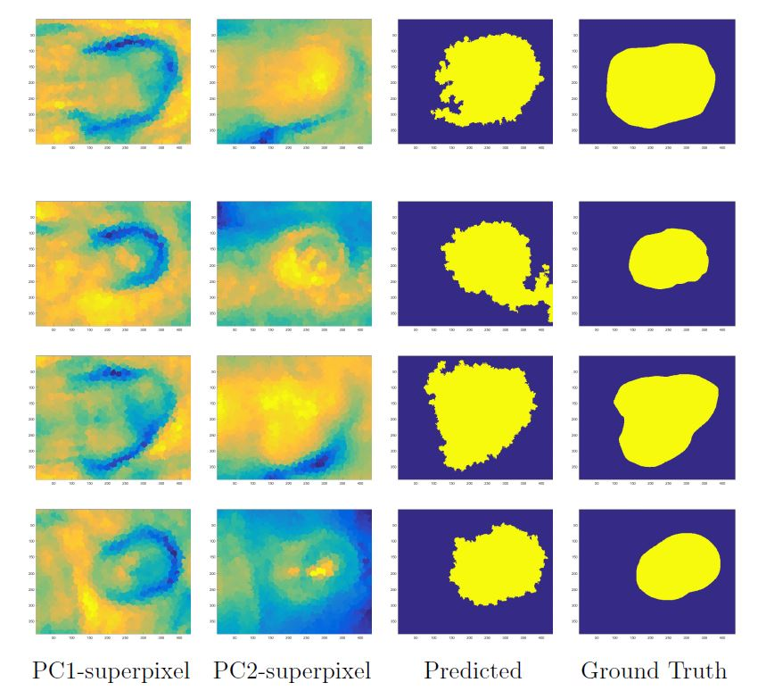
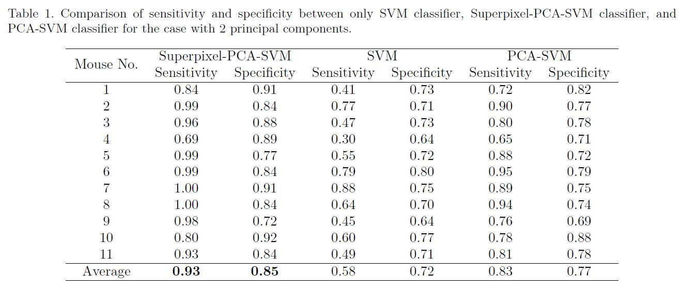

# HyperspectralClassification

Project Title: Superpixel-based spectral classification for the detection of head and neck cancer with hyperspectral imaging.

Details: Performed machine learning and image processing techniques to 11 mice each with a large dataset. Applied PCA feature extraction to reduce the number of bands to 2 principal components. Performed image clustering with superpixels to reduce computation. Utilized R-SVM to train the model and classify tumor. Used a leave-one-out cross-validation on 11 mice dataset and obtained an average 93% sensitivity and 85% specificity over 11 mice. Reduced total computation time from days to less than 15 minutes. 

Submitted first author and presented paper at 2016 SPIE Medical Imaging: Precision Medicine conference as an oral talk.
Link: https://www.ncbi.nlm.nih.gov/pmc/articles/PMC5028206/

## Basic Overview

<p align="center"></p>


## Install 
Need to download files and libraries 
SLIC Code: Download the SLIC codes from http://ivrl.epfl.ch/files/content/sites/ivrg/files/supplementary_material/RK_SLICsuperpixels/SLIC_mex.zip

LIBSVM: Make sure to have the libsvm library downloaded and extracted in the folder called Codes. https://www.csie.ntu.edu.tw/~cjlin/libsvm/ or https://www.csie.ntu.edu.tw/~cjlin/libsvm/#matlab

## Set Path and Parameters
```
superpixel = 0;                                   % 1=Include superpixel 0=Not include superpixel
project_label = 'Trial1';                         % Project Trials
Num_PCA = 2;                                      % Number of PCA to Analyze 
Num_Superpixel = 500;                             % Number of Superpixels Ex) Num_Superpixel = 1000
Project = 'Results_PCA_SLIC';                     % Results Folder Name
Results_Dir = strcat(pre_directory,'Results');    % Name Results folders for all results
Superpixel_Constraint = 200;                      % Superpixel size constraint. 
                                                  % Large values makes the superpixel more confined. 
                                                  % Ex) Superpixel_Constraint = 100
Figures = 1;                                      % Set Figures = 1 if you want to observe figures during code
Name_All = {'888', '889', '890', ...
            '891', '892', '893', ...
            '894', '895', '896', ...
            '897', '898'};                        % Mice Numbers
w = 450:2:880;                                    % Wavelength Region of Analysis
Downsample = 2;                                   % Downsampling Factor for Images
```

## Run Code
Need to Compile the C file using ```mex slicmex.c```before running the main script below
```
run_script.m 
```

## Output - Images

<p align="center"></p>
An illustration of the superpixel segmented regions, predicted tumor, and ground truth images for four different mice.

## Output - Classification Results

<p align="center"></p>
After running the code, the output of the classifier should match up to the results shown in the table. 

## 
functions
function_PCA_SVM.m
Combine_Cell_Vector.m
Feature_Stand.m
Superpixel_SLIC.m
